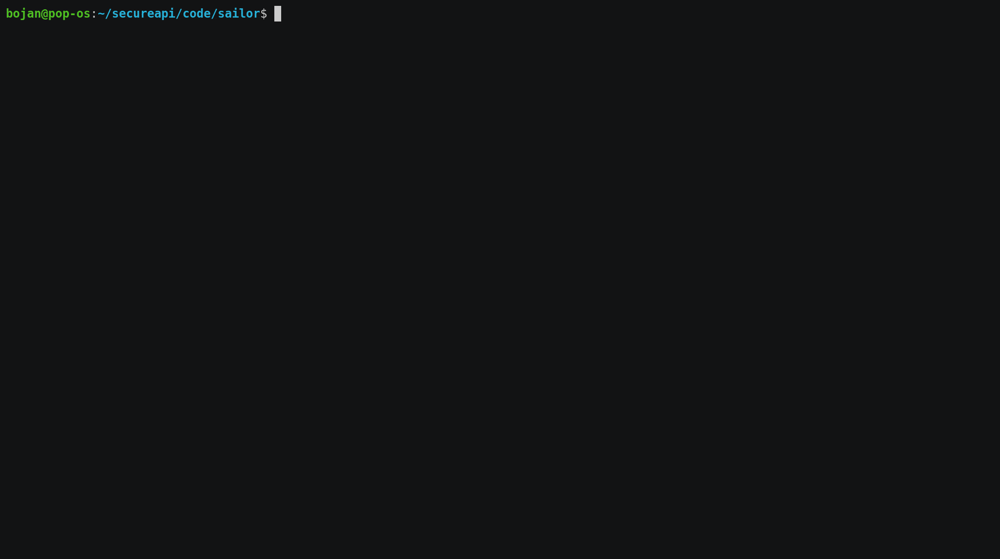

# Sailor

[](https://golangci.com)

[](https://hub.docker.com/r/secureapi/sailor)

Sailor is command line tool for security testing your web APIs. Developed and maintained by SecureAPI


## Quickstart
To run security checks on your API, set `url` you want to test and your SecureAPI `username` and `accessKey`  in `.secureapi.yml` and execute this command:
`sailor run`

## Demo

#### Example config
To generate config template, run `sailor init-config`. This will create `.secureapi.yml` file in following format:

| Config key | config value | Description |
| ---------- | ------------ | ----------- |
|  username  |   hidalgopl  | Your SecureAPI username |
| accessKey  | 74nfdj3n...2342 | Your SecureAPI access key |
|    url     | https://secureapi.dev/demo | URL you want to test|

That's all. That's it. Then simply run it by typing `sailor run`!

Sailor will produce output:
```bash
INFO[0000] Authenticated for hidalgopl                     
INFO[0000] [bssgpb55ictis3l56rj0] -> SEC0007 : result: failed 
INFO[0000] [bssgpb55ictis3l56rj0] -> SEC0003 : result: passed 
INFO[0000] [bssgpb55ictis3l56rj0] -> SEC0002 : result: passed 
INFO[0000] [bssgpb55ictis3l56rj0] -> SEC0005 : result: passed 
INFO[0000] [bssgpb55ictis3l56rj0] -> SEC0006 : result: passed 
INFO[0000] [bssgpb55ictis3l56rj0] -> SEC0004 : result: passed 
INFO[0000] [bssgpb55ictis3l56rj0] -> SEC0008 : result: passed 
INFO[0000] [bssgpb55ictis3l56rj0] -> SEC0009 : result: passed 
INFO[0000] [bssgpb55ictis3l56rj0] -> SEC0001 : result: failed 
INFO[0000] all tasks executed successfully. Link to your test suite: https://secureapi.dev?suite-id=bssgpb55ictis3l56rj0 
---------------------------------------------------------------------------------------------
SEC0007: Strict-Transport-Security: max-age=(age in seconds); (other options)
This header lets a web site tell browsers that it should only be accessed using HTTPS, instead of using HTTP.
Learn more: https://developer.mozilla.org/en-US/docs/Web/HTTP/Headers/Strict-Transport-Security

---------------------------------------------------------------------------------------------
---------------------------------------------------------------------------------------------
SEC0001: X-Content-Type-Options: no-sniff
The server should send an X-Content-Type-Options: nosniff 
to make sure the browser does not try to detect a different Content-Type 
than what is actually sent (as this can lead to XSS)
Learn more: https://developer.mozilla.org/en-US/docs/Web/HTTP/Headers/X-Content-Type-Options

---------------------------------------------------------------------------------------------
```

You can click on the link to your tests and learn there how to fix your security issues.

## Install
Binary downloads of the Sailor can be found on [the Releases page](https://github.com/hidalgopl/sailor/releases/latest).

Unpack the `sailor` binary and add it to your PATH and you are good to go!

### Compile from source
Clone this repository and run `make build`. 


## Send us feedback
We would love to hear your feedback. We know that no one has time and will to deal with long survey, so we build feedback collector directly into sailor.
Simply type `sailor feedback` and answer 5 questions (3 are 0-5 scale, only one open question, so you don't waste your time).
Check it out:
[
## CI / CD
Since sailor is single binary, it's really easy to incorporate it in your CI / CD cycles.
### Jenkins integration

### Gitlab integration
Add `SECUREAPI_USERNAME` & `SECUREAPI_ACCESS_KEY` to CI/CD variables in Gitlab UI.
`.gitlab-ci.yml`
```yaml
stages:
 - sectests

secureapi:
  image: secureapi/sailor:latest
  stage: sectests
  script:
    - cat <<EOF > .secureapi.yml
      username: "$SECUREAPI_USERNAME"
      accessKey: "$SECUREAPI_ACCESS_KEY"
      EOF
    - sailor run
```

### Bitbucket pipelines integration
Add `SECUREAPI_USERNAME` & `SECUREAPI_ACCESS_KEY` to bitbucket variables.
`bitbucket-pipelines.yml`
```yaml
image: secureapi/sailor:latest
pipelines:
  default:
    - step:
        name: Create config
        script:
          - cat <<EOF > .secureapi.yml
            username: "$SECUREAPI_USERNAME"
            accessKey: "$SECUREAPI_ACCESS_KEY"
            EOF
    - step:
        name: Run tests
        script:
          - sailor run

```

### Github actions integration
In your deploy repository, set `SECUREAPI_USERNAME` & `SECUREAPI_ACCESS_KEY` secrets.
Then, just paste this:
```yaml
    - name: Run sailor
      uses: secureapi/sailor-action@master
      with:
        url: "https://apistaging.secureapi.dev/tests/my"
        username: ${{ secrets.SECUREAPI_USERNAME }}
        access_key: ${{ secrets.SECUREAPI_ACCESS_KEY }}
```
You can find [secureapi/sailor-action](https://github.com/secureapi/sailor-action) in Github Actions marketplace. We're working hard to keep this as up to date as possible.

### CircleCI
Set env variables in CircleCI project:
Add `SECUREAPI_USERNAME` & `SECUREAPI_ACCESS_KEY` to env variables in CircleCI UI.
```yaml
    version: 2.1
    executors:
        docker:
          - image: secureapi/sailor:latest
    jobs:
      sec_test:
        steps:
          - run:
              name: Create config
              command: |
                             cat <<EOF > .secureapi.yml
                             username: "$SECUREAPI_USERNAME"
                             accessKey: "$SECUREAPI_ACCESS_KEY"
                             EOF
          - run:
              name: Run tests
              command: sailor run
    workflows:
      version: 2
      build-master:
        jobs:
          - sec_test
```

### TeamCity

### TravisCI
Add `SECUREAPI_USERNAME` & `SECUREAPI_ACCESS_KEY` env variables to Repository Settings.
```yaml
sudo: required
language: go
services:
  - docker
before_install:
  - docker pull secureapi/sailor:latest
  - docker run -it -d --name build secureapi/sailor:latest bash
  - docker exec build git clone https://github.com/user/product.git
script:
  - docker exec build cat <<EOF > .secureapi.yml
                      username: "$SECUREAPI_USERNAME"
                      accessKey: "$SECUREAPI_ACCESS_KEY"
                      EOF
  - docker exec build sailor run
```
### Bamboo

## How it works
Sailor is a simple tool. It parses the config, sends request to provided URL and then passes all needed information from response to SecureAPI. SecureAPI analyses it and pinpoints where are your security vulnerabilities.
